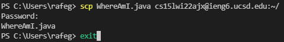
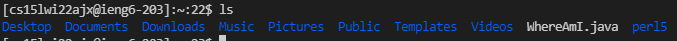
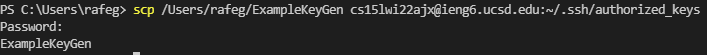
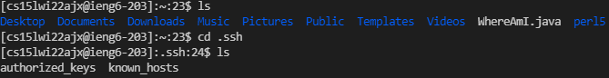
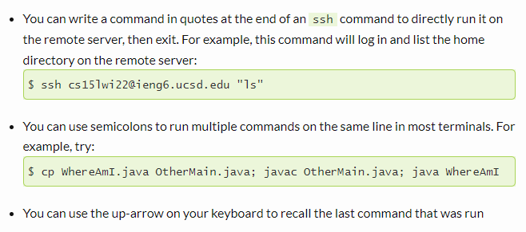

# Lab Report 1 (Remote Connection):

## Step One: 
Download [VS Code](https://code.visualstudio.com/download) and openSSH if your PC doesn't have it. After that run the executable and choose your desired install path. Make sure you can open a new file etc.

## Step Two:
In the Get Started menu of VS Code, click the Terminal buttom at the top left of the screen. In the drop-down menu, click the create new terminal button, and then from there type the following command to connect to your account: `ssh cs15lwi22ajx@ieng6.ucsd.edu`

## Step Three: 
You should see something similar to the picture above. Now play around with some example commands like ls to list all the files in your current directory, or cd to move to directory within your current one.

## Step Four: 
Create a new java file like you normally would (i.e., new file), and from there do your coding. When you're ready to copy it to your server location open a new terminal in your file's working directory, then type in scp "your file name" "your server name" to copy it into your server account after you enter your password. You then close this terminal, and type ls in your home path in your server account terminal to ensure the file copied.

## Step Five:
Open a terminal in your user or PC directory, and then type in ssh keygen. Create a textfile in your user directory to store the key it, and then enter a passphrase and store the key in that file. Then, use the scp command in the same terminal to copy the file with key from your user directory to your server account under the /.ssh/authorized_keys directory.

## Step Six:
You can run commands immediately after connecting via the same line in the terminal, or you can even run numerous files at once (Credit: Joe Politz).

