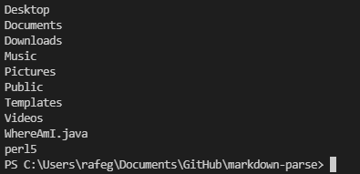

# Lab Report 1 (Remote Connection):

## Installing VS Code
Download [VS Code](https://code.visualstudio.com/download) and openSSH if your PC doesn't have it. After that run the executable and choose your desired install path. Make sure you can open a new file under the file tab, and make note of your working directory (e.g., user\VSCode\projects). 

## Remotely Connecting
In the Get Started menu of VS Code, click the Terminal buttom at the top left of the screen. In the drop-down menu, click the create new terminal button, and then from there type the following command to connect to your account: `ssh cs15lwi22XX@ieng6.ucsd.edu`, with XX being your assigned letters. You will then have to enter your password, and after that, you will be in the home directory of your student remote account.

## Trying Some Commands
Some example commands include `ls` to list all the files in your current directory, or `cd` followed by the directory name, to move to a directory within your current one. You can also use `cp` to copy files from a given directory, `make` to create new files of whatever type, and when you're done, type `exit` to cut your connection.

## Moving Files with `scp`
Create a new java file like you normally would (i.e., click file, then hit new file), and from there do your coding. When you're ready to copy it to your server location open a new terminal like we did above in your file's working directory, then type in `scp "your file name" "your server name"` to copy it into your server account after you enter your password. You then close this terminal, and type `ls` in your home path in your server account terminal to ensure the file copied. After typing `ls`, you should observe your file in the list of files present, assuming you just copied it to the home directory of your terminal.

## Setting an SSH key
Open a terminal in your user or PC directory, and then type in `ssh keygen`. Create a textfile in your user directory (i.e., utilize file explorer to navigate to the spot where you wish to store the key and create a blank text file) to store the key in it. Then, copy the directory in which you are working to the terminal where it asks for a file, and then enter a passphrase and store the key in that file. After that, boot up your student account, per the steps above, then type in `mkdir .ssh` to make a directory for your ssh key. Then use the `scp` command in the same terminal to copy the file with key from your user directory (see pic below) to your server account under the /.ssh/authorized_keys directory. You can navigate to your KeyGen directory using the `cd` commands in succession to move from directory to directory.

## Optimizing Remote Running
Now that we've set up an SSH key, we can go into our student account on a whim, or even access commands immediately on the same line as the `ssh` command. For example, you can type `ssh cs15lwi22@ieng6.ucsd.edu "ls"` to immediately enter your account and list its contents. Since you have the SSH key setup, you no longer need to enter your password, which saves me about twenty keystrokes for my password. In addition, since you have to hit "enter" every single time, you are saving time in this regard or one keystroke in this case, which may not seem like much, but if you enter dozens of commands on the same line, it could save time. In addition, you can copy multiple files at once saying something like `cp WhereAmI.java OtherMain.java; javac OtherMain.java; java WhereAmI` to copy all of those files at once. Thats at at least 4 keystrokes saved, and if you `ssh` in at the same time, that's 24, making your experience more efficient.

