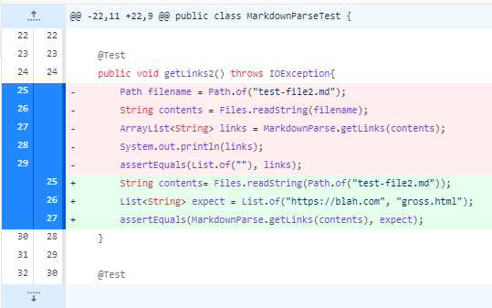

# Lab Report Week 4

## Code Change One
**Diff Example**

""blank link infinite loop bug
edit a test case and show the diff with it, it was read only

##link to the failure inducing input

##infinite loop

##bug is faulty code, symptom infinite loop, and the failure input is the md file'
