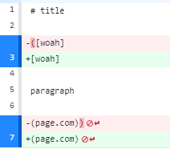
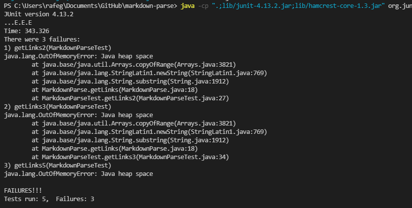

# Lab Report Week 4

## Change One: Images are Not Links
**Diff**

The [test-file](https://github.com/rafegers0n/cse15l-lab-reports/edit/main/test-file.md) that spurred us to make a change was:

The symptom of this bug was image files being included in the output after running our terminal commands. 

Both images and links use square brackets followed by parantheses, and our code doesn't know the difference between the two as it just searches for that order and adds the item to our toReturn arraylist, which is a bug. The symptom of this was that both images and links were printed in our final output. To rectify this, we added a sample of image extensions, which we can add to later, and created a for loop that checks the substring in our parantheses, the substring that would be added to our toReturn arraylist, for these extensions, and if it has any, it doesn't get added and doesn't get returned in our output.

## Code Change Two
**Diff Example**

In [test-file3](https://github.com/rafegers0n/cse15l-lab-reports/blob/main/test-file3.md), we put the brackets and parantheses in the wrong order to see what would happen. This caused an infinite loop (symptom) to occur when we ran our test as our junit test expected "(https://example.com)", but our code actually contained "(a link!)", so our code iterated until we ran out of memory, looking for our expected value and not being able to find it. By swapping the order of the parantheses and brackets, as seen in the diff above, our tests then work as expected.

## Code Change Three
**Diff Example**

In [test-file5](https://github.com/rafegers0n/cse15l-lab-reports/blob/main/test-file5.md), we put text in between the brackets and parantheses, and then put parantheses around the whole setup to see what would happen. This caused an infinite loop (symptom) to occur when we ran our test as our junit test expected "(page.com)", but our code actually contained "([woah](page.com))", so our code iterated until we ran out of memory, looking for our expected value and not being able to find it. By removing the extra parantheses, as seen in the diff above, our tests then work as expected.
