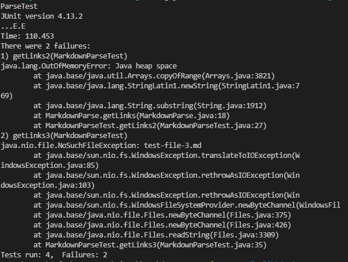
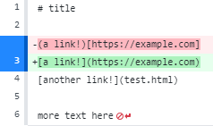
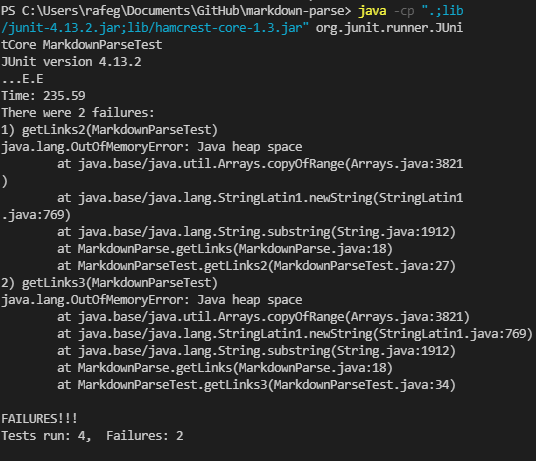

# Lab Report Week 4

## Code Change One
**Diff Example**

In [test-file2](https://github.com/rafegers0n/cse15l-lab-reports/edit/main/test-file2.md), there was a stray parantheses (bug) in the site name. This caused an infinite loop (symptom) to occur when we ran our test as our junit test expected "(https://blah.com)", but our code actually contained "(https://blah).com)", so our code iterated until we ran out of memory, looking for our expected value and not being able to find it. By removing this parantheses, as seen in the diff above, our tests then work as expected.

## Code Change Two
**Diff Example**

In [test-file3](https://github.com/rafegers0n/cse15l-lab-reports/blob/main/test-file3.md), we put the brackets and parantheses and parantheses in the wrong order to see what would happen. This caused an infinite loop (symptom) to occur when we ran our test as our junit test expected "(https://example.com)", but our code actually contained "(a link!)", so our code iterated until we ran out of memory, looking for our expected value and not being able to find it. By swapping the order of the parantheses and brackets, as seen in the diff above, our tests then work as expected.
