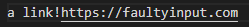

# Lab Report Week 4

## Change One: Images are Not Links
**Diff**

The [test-file](https://github.com/rafegers0n/cse15l-lab-reports/edit/main/test-file.md) that spurred us to make a change was:

The symptom of this bug was image files being included in the output after running our terminal commands. 

Here is our correct output:

Both images and links use square brackets followed by parantheses, and our code doesn't know the difference between the two as it just searches for that order and adds the item to our toReturn arraylist anyway, which is a bug. When we went to return our arraylist, the symptom of this was that both images and links were printed in our final output. To rectify this, we added a sample of image extensions (e.g., png, jpg, gif, etc), which we can add to later, and created a for loop that checks the substring in our parantheses, the substring that would be added to our toReturn arraylist, for these extensions, and if it has any, it doesn't get added and doesn't get returned in our output.

## Change Two: Ensuring Correctness of Links
**Diff**

The [test-file](https://github.com/rafegers0n/cse15l-lab-reports/edit/main/test-file2.md) that spurred us to make a change was:

The symptom of this bug was an infinite loop 

Here is our correct output:

As we know, brackets are supposed to be followed by parantheses, and we keep track of the current indexes of the two brackets and two parantheses through their respective variables (e.g., nextOpenBracket, openParan, etc). The bug lied in the fact that the code would yield invalid indexes as expected from our input, except it could not handle these indexes that don't exist (i.e., indexes of -1). When it attempted to obtain and add the substring derived from these invalid indexes, it got stuck in an infinite loop, which is the symptom. The only reason it didn't throw an index out of bounds for our input is because there was already a correct link in there. To rectify this, we implement an if statement that checked that the distance between the final bracket and the first parantheses is 1, or that they were right next to eachother, and if they are, we can then add the substring to our toReturn as usual. Substrings that do not meet this condition are simply ignored, and the correct values are now returned rather than infinite loop.

## Preventing Infinite Loops and Other Errors
**Diff Example**

The [test-file](https://github.com/rafegers0n/cse15l-lab-reports/edit/main/test-file3.md) that spurred us to make a change was:

The symptom of this bug was a string index out of bounds exception.

Here is our correct output:

The reason this one is different than the last is because there was no correct links to begin with, which means there was nothing in our toReturn arraylist, but it still tried to add something from an invalid index, which yielded an index out of bounds exception. At this point, we need to implement more sweeping changes. The bug in our code was that it only handled specific indexes when they were invalid, but when other indexes are invalid, our code does not address this, and this will yield an index out of bounds exception, our symptom, when the code is run. In reality, if any indexes are invalid, the code should be stopped immediately. In the code change, we adding an if statement that if any of the indexes are invalid, we break the loop immediately, and no errors or infinite loops occur now. Now, our toReturn arraylist returns, and if none of the links were valid, the arraylist is empty, as seen above.
