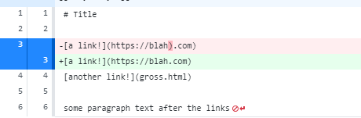

# Lab Report Week 4

## Code Change One
**Diff Example**

In [test-file2](https://github.com/rafegers0n/cse15l-lab-reports/edit/main/test-file2.md), there was a stray parantheses (bug) in the site name. This caused an infinite loop (symptom) to occur when we ran our test as our junit test expected "(https://blah.com)", but our code actually contained "(https://blah).com)", so our code iterated until we ran out of memory, looking for our expected value and not being able to find it.

##link to the failure inducing input

##infinite loop

##bug is faulty code, symptom infinite loop, and the failure input is the md file'
