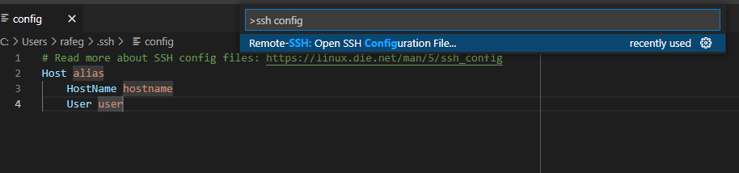

# Lab Report Week 6

## Streamlining SSH
First we need to access my SSH config file. To do this, we hit hit F1 and open a search bar in VS code, then type "ssh config" in the bar and click on the Remote-SSH: Open SSH Configuration File. This will open up the generic config file which has not been configured yet.
