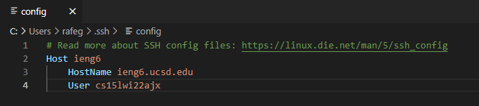
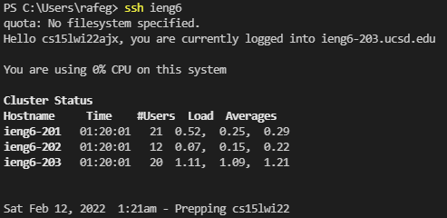
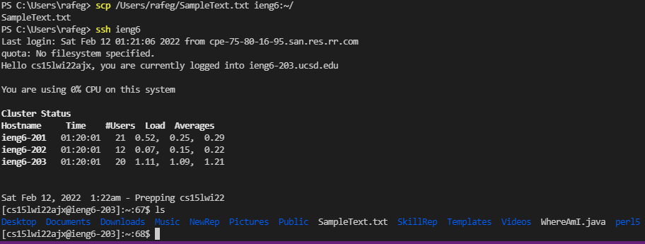

# Lab Report Week 8

[My Markdown Parse](https://github.com/rafegers0n/markdown-parse)
[Other Markdown Parse](https://github.com/5ean-github/markdown-parse)

Now we edit the config file to our liking, as seen below, and create our alias `ieng6` using our account information. 

Assuming I have already completed the step from Lab One where I created an SSH key and made my computer an authorized user, all I have to do is type `ssh ieng6` to log into my account. 

Even better, I can copy files using the `scp` command followed by the file I wish to copy followed by my alias `ieng6`, rather than typing my full account name everytime I wish to `ssh` into my account and copy a file. 

As we can see, the file is there and the process worked!

