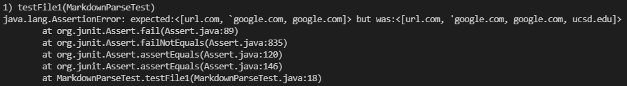
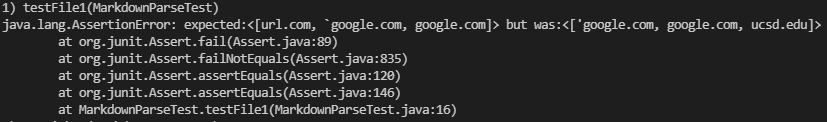
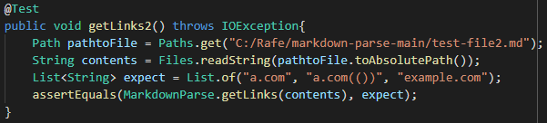
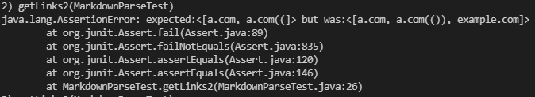
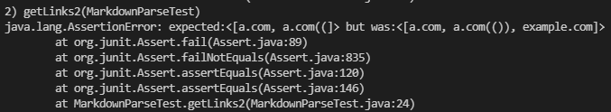
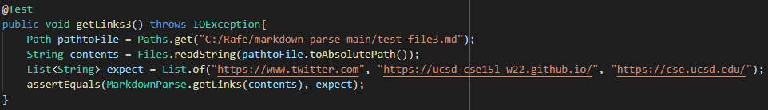
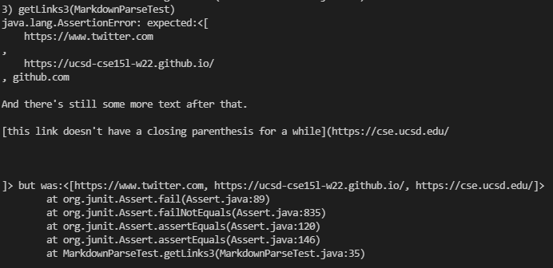
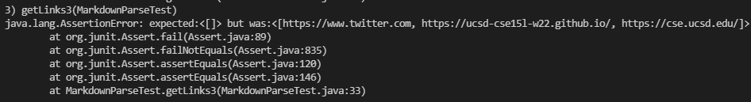

# Lab Report Week 8

## Links
[My Markdown Parse](https://github.com/rafegers0n/markdown-parse)
[Other Markdown Parse](https://github.com/BenX-64/markdown-parse)

## Snippet One

Expected: `['google.com, google.com, ucsd.edu]`

My Output:

Other Output:

Code Fix:

## Snippet Two

Expected: `[a.com, a.com(()), example.com]`

My Output:

Other Output:

Code Fix:

## Snippet Three

Expected: `[https://ucsd-cse15l-w22.github.io/]`

My Output:

Other Output:

Code Fix:
