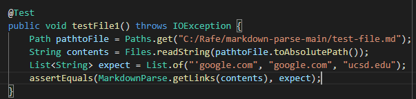

# Lab Report Week 8

## Links
[My Markdown Parse](https://github.com/rafegers0n/markdown-parse)

[Other Markdown Parse](https://github.com/BenX-64/markdown-parse)

## Snippet One

Expected: `['google.com, google.com, ucsd.edu]`

My Output:

Other Output:

Code Fix:

I do not believe there exists a small code change that would make the program work for snippet one. Since there are brackets in the backticks, I would have to add a feature that differentiates between different types of brackets based off of the things around it in order to identify actaul code blocks and determine which is our start and end bracket, and this feature would definitely take more than 10 lines based on how I envision it.

## Snippet Two

Expected: `[a.com, a.com(()), example.com]`

My Output:

Other Output:

Code Fix:

There is a short code fix that exists for snippet two I believe. Usually, the last parantheses is the correct one which determines the end of the series of links, so we just need to have a method that gets the index of that one and uses it in our getLinks method.

## Snippet Three

Expected: `[https://ucsd-cse15l-w22.github.io/]`

My Output:

Other Output:

Code Fix:

There is a pretty short code fix for this one I believe. The new lines in the original file are represented by the character `\n`, so we just add a line that skips over these and lines connected to it when we get our links.
