# Lab Report Week 10

## `Diff` Use
I used the command `bash script.sh > results.txt` inside each respective directory to save the output of each version of MarkDownParse for each of our 600 or so tests. I then ran `diff markdownparseother/markdown-parse-main/results.txt markdown-parse/results.txt` in the main directory to compare the results of each version of MarkdownParse for the 600 or so test files. In the below image, I show what a snippet of what the `Diff` between the two files is, and I manually traversed this to find my test cases.

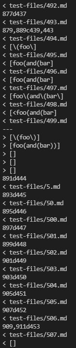

## Test One
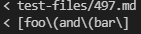

The top image contains the result of the given implementation on test 497, and the bottom is mine for test 497.
### Given Implementation
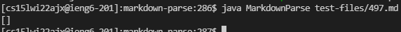

### My Implementation
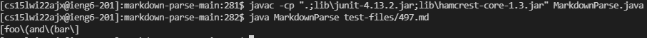

### Test File
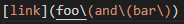

For this one, I'd have to say that my implementation is right because even though there are extra parantheses, we're still following the left bracket, right bracket, left parantheses, right parantheses rule, which means we should be printing a link.

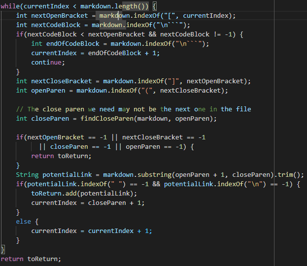

I think the issue with the given implentation is that it looks for the "close paren" or right parantheses too early and trims it beforce it can get added to our toReturn. I'd suggest to just keep it simple by using a substring of left parantheses to the lastIndex of close parantheses, and we'll clean up the substring that is printed manually with some other code.

## Test Two
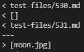

The top image contains the result of the given implementation on test 530, and the bottom is mine for test 530.
### Given Implementation
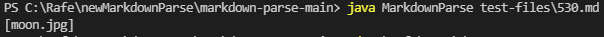

### My Implementation
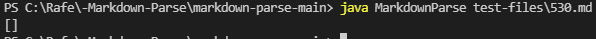

### Test File
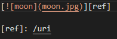

For this one, I'd say my implementation is right again because an image extension, while using a similar format to the links in markdown, is not a link, so we shouldn't be printing anything.

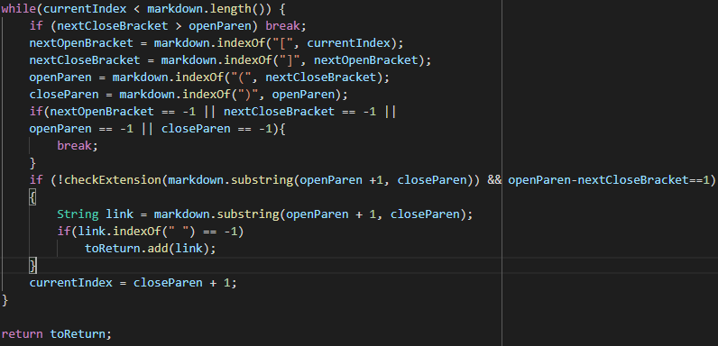

I put a picture of both codes for reference, but basically you need a separate helper, like `checkExtension`,  method that reads the extensions of the things within the parantheses, and if it contains any of the extensions like `.PNG`, `.JPG`, `.GIF`, etc, it will not be printed.
