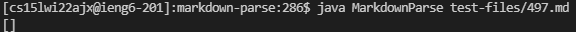

# Lab Report Week 10

## `Diff` Use
I used the command `bash script.sh > results.txt` inside each respective directory to save the output of each version of MarkDownParse for each of our 600 or so tests. I then ran `diff markdownparseother/markdown-parse-main/results.txt markdown-parse/results.txt` in the main directory to compare the results of each version of MarkdownParse for the 600 or so test files. In the below image, I show what a snippet of what the `Diff` between the two files is, and I manually traversed this to find my test cases.

## Test One

 

